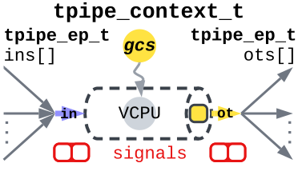
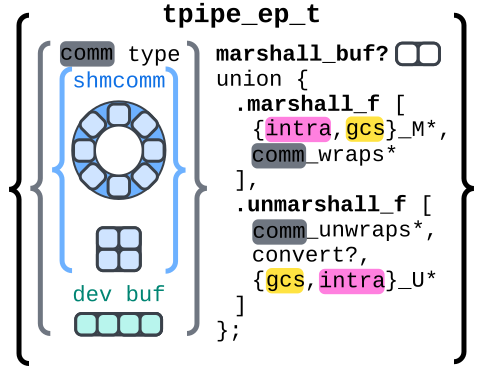
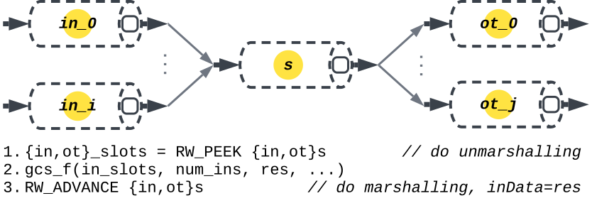
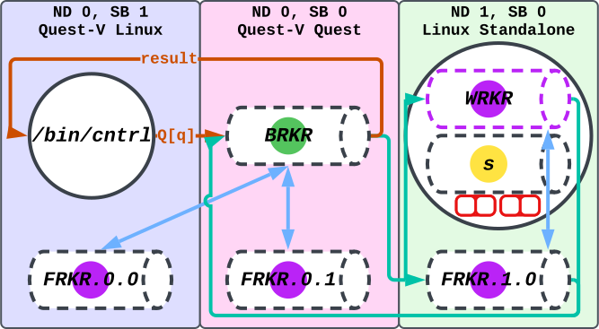
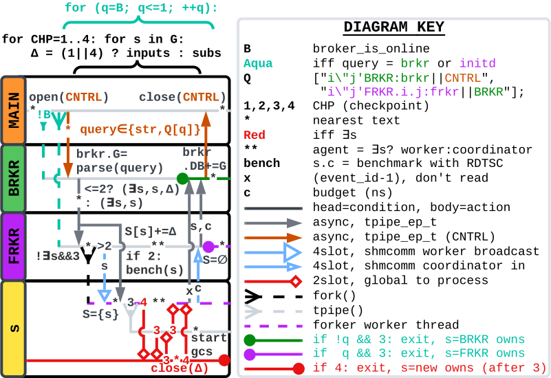
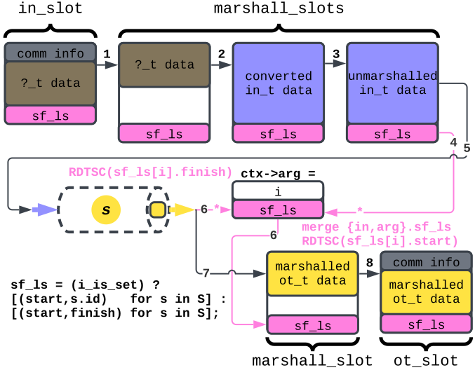
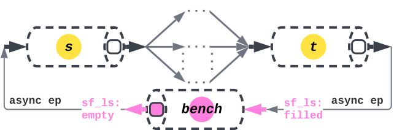
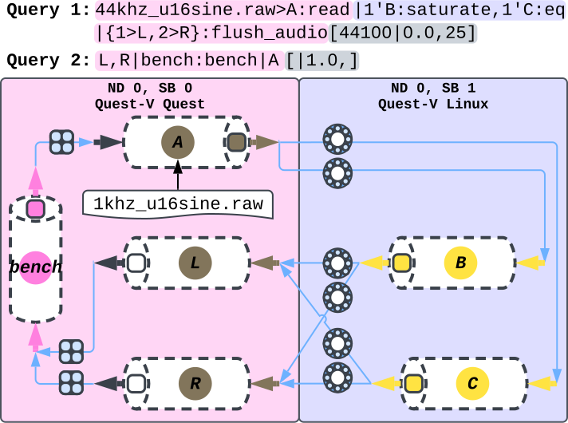
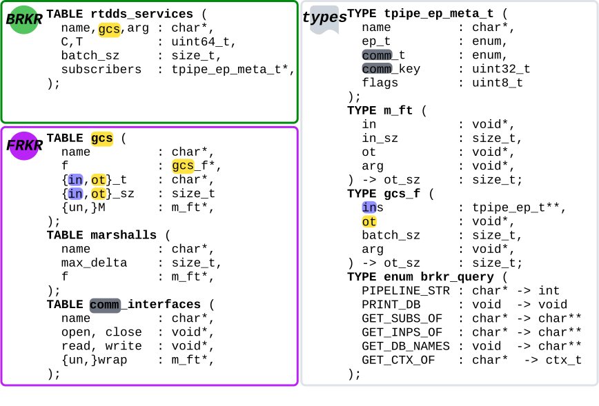
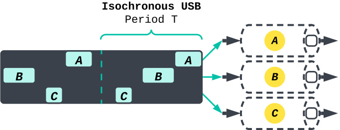

| [[file:../index.html][../]] | [[file:RT-DDS Overview.html][RT-DDS Overview]] |  | 
#+OPTIONS: toc:nil num:nil
#+OPTIONS: ^:nil
#+TITLE: RT-DDS Overview

* Introduction

** General Overview

This document serves as an overview for *RT-DDS (Real-Time Data
Distribution Service)*, which is a pub-sub framework for scheduling
pipelines of services to meet the following hard *real-time Quality of
Service (QoS)* guarantees on end-to-end:

1. *throughput (tput)*,
2. *latency (latn)*, and
3. *data loss (loss)*.

This DDS works on the following platforms and can subscribe services
across them (e.g. service A in Linux subscribes to service B in
Quest):

1. Standalone Ubuntu Linux
2. Standalone Quest
3. Quest guest on Quest-V Hypervisor
4. Linux guest on Quest-V Hypervisor

The two primary goals of this document are to:

1. Familiarize the reader with the design logic
2. Show the reader how to use the API — both for creating pipelines
   with existing RT-DDS infrastructure, and for porting their
   applications to the framework.

Therefore, minute implementation details of the DDS may be omitted;
however, the overall logic is captured.

** Formatting and abbreviation

All coloring is consistent throughout, and all graphics are scalable
vector graphics (SVGs), allowing for zoom without quality
loss. Additionally, each definition, often paired with an
abbreviation, is presented in the format: *name (abbreviation)*.

* Tuned Pipes (tpipes)

** Computational Model

Every service in RT-DDS is associated with a *tuned pipe (tpipe)*. A
tpipe is a pthread possibly bound to a *virtual CPU (Quest, VCPU)* or
*SCHED_DEADLINE server (Linux)* with
*budget C* and *period T* (in nanoseconds). It has a single input
endpoint and a single output endpoint. A tpipe may connect its input
endpoint to multiple publishers output endpoints by subscribing
through the broker, and other tpipes may subscribe to its output
endpoint in the same manner.

#+NAME: fig:tpipe_context
#+CAPTION: tpipe context.

** Tpipe Endpoints - Inputs and Subscribers

The *tpipe_endpoint (tpipe_ep_t)* allows for subscriptions across
communication types (e.g. *shared memory communication (shmcomm)* or
*USB*) via a unified interface. The subscriber specifies the
communication type. Currently, only shmcomm is supported, with two
buffering semantics:

1. *FIFO ring*: synchronous, lossless
2. *4slot*: asynchronous, freshest data

The *tpipe_ep_t* also handles *marshalling* and *unmarshalling*. Since
data types and communication types may differ, each endpoint includes
an ordered list of marshall functions to manage communication header
wrapping/unwrapping, data conversion, transforms and filters, as well
as **intra-marshalling** of metadata.

#+NAME: fig:tpipe_ep_t
#+CAPTION: A tpipe_ep_t

* Gather-Compute-Scatter (gcs)

#+NAME: listing:gcs_f
#+CAPTION: Every RT-DDS service executes a gcs function. Here is an example of gcs_sum_u16.
#+BEGIN_SRC c
GCS(gcs_sum_u16,                /* name */
    uint16_t,                   /* in type (post-conversion) */
    uint16_t,                   /* out type */
    {unmarshall1, unmarshall2, ...}, /* unmarshall funcs */
    {marshall1, marshall2, ...},     /* marshall funcs */
    {float_to_u16, uint32_to_u16})   /* allowed unmarshall conversions */
{ 
  uint16_t *in, *out;
  PER_SLOT {                    /* foreach input slot */
    PER_EL {                    /* if batch_sz > 1, multiple elements in slot */
      out[el] *= (slot > 0);
      out[el] += in[el];
    }
  }
  return out_slot_size;         /* size of data processed */
}
#+END_SRC

If you want to port your application to RT-DDS you must write all
functions as gcs functions with minimal branching for pipelines with
QoS, to allow for RT-DDS to benchmark accurate budgets for each
service. The new gcs functions need to either be
 * added to the ~libgcs~ global index of gcs functions and recompiled, or
 * if the platform supports shared objects, then compiled into a
   shared object. The user can then specify in their runtime API
   request
   ~/path/to/userlib.so.function_name.arg>service_name:gcs_dl_open~.

Calling *tpipe_gcs()* gathers all inputs and subscriber buffers by
calling ~tpipe_ep_read(..., RW_PEEK)~ or ~tpipe_write(...,
RW_PEEK)~. If gathering succeeds, it runs the gcs function, then
scatters the output to subscribers and updates endpoint states with
~RW_ADVANCE~ (e.g. incrementing the position in a FIFO ring).

#+NAME: fig:tpipe_gcs
#+CAPTION: tpipe_gcs()

* Agents: Broker, Forker

** Agent overview

RT-DDS uses several agents across sandboxes/nodes:

1. Exactly one *Broker (BRKR)*
2. Exactly one *Forker (FRKR)* per sandbox
3. At most one thread querying the broker (e.g. */bin/cntrl*)

All agents are bound to *tpipes with no QoS (best-effort scheduling)*.

When a service is forked, the child contains the service tpipe and a
child FRKR thread. The child FRKR reassigns itself as a WRKR. If the
broker is queried to update this service, the broker notifies the
coordinator FRKR, which wakes the WRKR to create a new version and
swap it with the old.

#+NAME: fig:rtdds_agents
#+CAPTION: RT-DDS agents

Figure [[fig:rtdds_agents_swimlane]], deepens the understanding from
figure [[fig:rtdds_agents]], covering the logic for use cases of
instantiating:

1. BRKR and FRKR for sandbox (!B)
2. FRKR for sandbox (B)
3. Service creation (!∃s)
4. Service updates (∃s)

RT-DDS applies the logic from 3 and 4 to also do 1 and 2, ensuring
service isolation and dynamic updates via WRKR daemons. 

** Agent coordination

#+NAME: fig:rtdds_agents_swimlane
#+CAPTION: RT-DDS agent swimlane logic.

*** Benchmarking

Checkpoint 2 (figure [[fig:rtdds_agents_swimlane]]) involves benchmarking
each service individually using the read *timestamp counter (rdtsc)*
opcode, after all of its inputs and subscribers have been
initialized. This is done using the ~tpipe_gcs()~ function, where each
~tpipe_ep_{read,write}~ call is made with *RW_REPLAY*, ensuring
deterministic behavior by always operating on the same slot and never
failing. The benchmarking continues until either the estimated
performance stabilizes—meaning the confidence interval stops shrinking
significantly—or we become statistically confident (at the 95% level)
that the average execution time is within a ±1000 nanosecond margin of
error.

*** Scheduling

We assume phase-alignment and calculate the periods and batch_sz for a
pipeline in the broker. However, you can recompile RT-DDS to use your
own scheduling algorithm given the dataflow graph and [tput|loss,latn]
QoS. Table [[table:broker_sched]] and listing [[listing:broker_sched_loss]] detail the
current scheduling heuristics.

#+NAME: table:broker_sched
#+CAPTION: Broker scheduling. Stages are topological stages, i.e. we run topological sort, then move each service node as far-left as possible. A stage is a set of services at the same position along X-axis. Even though we specify the Qos as [tput|loss,latn], the calculations associated with each are processed in reverse order.
| *Value* | >0                                                          | 0                                      |
| *latn*  | VCPU with C/T                                               | Best-effort VCPU                       |
| *loss*  | comm_flags=ASYNC; T_stage1 = x, T_not_stage1 = y            | comm_flags=SYNC; T = latn / num_stages |
| *tput*  | Scale batch_sz until batch_sz / (min(T) * 1e-9 s/ns) ≥ tput | batch_sz = 1                           |

It is important to note that scaling batch_sz to match throughput is the
final step of the scheduling algorithm because this does not change the
period of each service, only the budget.

#+NAME: listing:broker_sched_loss
#+CAPTION: Pseudocode for calculating T given loss>0
#+begin_src
INPUT:  Pipeline with k stages, l (latn), r (loss)
OUTPUT: Period T_{stage_1}=x for stage 1 services and
        Period T_{note_stage1}=y for rest

SYSTEM OF EQUATIONS:
1 - x/y <= r
1 - x/y = r

x + (k-1)*y <= l
x + (k-1)*y = l

SOLVE:
x = -(r-1)*y
-(r-1)*y + (k-1)*y = l

SOLUTION:
y = l/(-(r-1) + (k-1)) = l/(k-r)

plug y in to get x:
x = -(r-1)*y
#+end_src

*** Other observations

Two non-trivial observations of figure [[fig:rtdds_agents_swimlane]] are
that (1) we can instantiate cyclic pipelines because of the
checkpointing in CHP1:open(CREAT) all inputs then CHP2:open(CONNECT)
all subscribers, and (2) the downtime between swapping an old service
out for a new one is 3T in the worst case with phase alignment and 6T
without phase-alignment; the red CHP3 is like a pipeline of rate
matched s_new->s_old->s_new. This means that swapping may cause a
jitter of up to 6 voided end-to-end batches in synchronous dataflow
graphs and 6 stale end-to-end batches in asynchronous ones. Upon
swapping at CHP3 with s_new, s_old destroys its VCPU.

* Marshalling

Inputs may not match the expected ~out_type~, but conversions can
allow reuse (e.g. ~u16_sum_u16~ accepts ~uint8_t~ or ~float~,
converting them to ~uint16_t~). Each gcs has a list of legal
conversions, and RT-DDS only creates subscriptions if the subscriber
can convert the publisher's output type to its own input type - if
they don't already match.

Marshalling may:

- Wrap/unwrap communication medium info (e.g. USB headers)
- Benchmark pipelines via intra-marshalling (passing (start, finish)
  tuples)
- Perform filters or transforms associated with the tpipe's gcs
  function.

#+NAME: fig:marshalling
#+CAPTION: Marshalling

In figure [[fig:marshalling]], intra marshalling is made possible by
keeping state in the tpipe_context (ctx). The "for s in S" has S as
either every service in the pipeline or just the source and sink. This
can be configured by the user through the RT-DDS API. Figure [[fig:bench]] shows
a generic implmenetation of benchmarking an RT-DDS pipeline.

#+NAME: fig:bench
#+CAPTION: Benchmarking an arbitrary pipeline. Because service "bench" has asynchronous interaction with the pipeline, it doesn't cause blocking.
#+ATTR_HTML: :style max-height:400px

* Examples

#+NAME: fig:RTDDS_PIPELINE_STR
#+CAPTION: Pipeline string specification for broker queries. See figure [[fig:dsp_bench_pipeline ]] for an example.
#+BEGIN_SRC
CNTRL_USAGE: ./rtdds_cntrl RTDDS_PIPELINE_STR
  ()  = Pipeline scope; last service continues flow
  {}  = bash-like expansion
  >   = Delimiters for argument. Can be applied to service or scope
  >>  = Concat service arg with scope-level arg
  "   = Node id; prefix with digit
  '   = Sandbox id; prefix with digit
  :   = Bind to gcs
  ,   = List
  |   = Pipe. Can have two consecutive for bidirectional subscription.
  ;   = Delimit pipeline clause. Can reference earlier services
  !   = Remove services/subscriptions, applies to entire clause
  [tput|loss,latn] = Pipeline QoS (at end of string)
    -> tput : uint64_t, elements per second
    -> loss : float∈[0,1], for ASYNC communication
    -> latn : uint64_t, microseconds; default = 0, i.e. best-effort
#+END_SRC

Figure [[fig:dsp_bench_pipeline]] is an example of the resulting state
from two pipeline string queries to the broker over the public control
channel.  Each ~tpipe_ep_t~ is colored as ~shmcomm~ (blue) and has the
corresponding buffer type: 4slot or FIFO ring. This figure is similar
to the boomerang work of having pipelines go into a sandbox from one
then back into the starting sandbox.

#+NAME: fig:dsp_bench_pipeline
#+CAPTION: Lossless stereo Digital Signal Processing (DSP) pipeline operating on 1kHz sine wave with 25 microsecond end-to-end latency (44kHz sample rate). We benchmark the pipeline with RT-DDS service bench, which has no QoS (assigned to best-effort OS scheduler) and a 100% loss rate to signify it uses async communication and is independent of the QoS for A, L, and R - if it wasn't we would have to assign a T to bench which yields the loss rate specified. B and C are part of libsoundpipe, which operates on s24_le samples, but this is no problem for connecting the services because we convert between types using unmarshall functions.
#+ATTR_HTML: :style max-height:600px

* State: Tables and Types

All GCS functions and marshall functions are in constant, global
tables with corresponding metadata information coupled for run-time
type-checking and proper buffer-sizing. Figure [[fig:state_types]] details
these tables.

#+NAME: fig:state_types
#+CAPTION: RT-DDS State tables and types. There are minor things omitted such as physical CPU, VCPU, and tpipe ids in the rtdds_services table. The point is to capture the logic. The comm_interfaces all implement the same functions to support a generic tpipe_ep_function() call.
#+ATTR_HTML: :style max-height:600px

The RT-DDS broker's table of rtdds_services is relly the RT-DDS
database (DB). It is implemented using a nested adjacency list using
hashmaps for O(1) updates.

* Future Direction

** Isochronous USB

Previously, it was stated that there was support for cross-node
pipelines. This is not yet implemented. Additionally, we want to be
able to multiple schedule USB transfers on the same link using
*rate-monotonic-scheduling (RMS)*, which we can do with *isochronous
endpoints*. This should later be implemented.

#+NAME: fig:isochronous_usb
#+CAPTION: Isochronous USB endpoints
#+ATTR_HTML: :style max-height:400px

